<div align="center">

<!-- HERO BANNER -->


## Geospatial Supply Chain and Logistics Optimization

### Using GIS · Network Analysis · Machine Learning · Operations Research · Spatial Intelligence

<br/>

[](https://www.python.org/)
[](https://jupyter.org/)
[](https://colab.research.google.com/)
[](https://www.openstreetmap.org/)
[](https://scikit-learn.org/)
[](https://networkx.org/)
[](LICENSE)

<br/>

[](https://github.com/khademali/supply-chain-gis/stargazers)
[](https://github.com/khademali/supply-chain-gis/network/members)
[](https://github.com/khademali/supply-chain-gis/issues)
[](https://github.com/khademali/supply-chain-gis/commits)
[](supply_chain_gis_optimization.ipynb)
[](supply_chain_gis_optimization.ipynb)

<br/>

> *"The efficiency of a supply chain is only as strong as the spatial intelligence that guides it."*

<br/>

**Author:** [Md Khadem Ali](https://khademali.com) · **Portfolio:** [khademali.com](https://khademali.com)

</div>

---

## Table of Contents

- [Abstract](#-abstract)
- [Key Features](#-key-features)
- [Methodology Workflow](#-methodology-workflow)
- [Project Architecture](#-project-architecture)
- [Technologies Used](#-technologies-used)
- [Installation](#-installation)
- [Google Colab Usage](#-google-colab-usage)
- [Project Structure](#-project-structure)
- [Notebook Sections](#-notebook-sections)
- [Outputs and Visualizations](#-outputs-and-visualizations)
- [Research Significance](#-research-significance)
- [Real-World Applications](#-real-world-applications)
- [Future Improvements](#-future-improvements)
- [Citation](#-citation)
- [Acknowledgements](#-acknowledgements)
- [License](#-license)
- [Copyright](#-copyright)

---

## Abstract

This project presents a **comprehensive, research-grade geospatial supply chain and logistics optimization framework** that integrates Geographic Information Systems (GIS), graph-theoretic network analysis, operations research, and machine learning into a single reproducible pipeline. Using real road network data sourced from OpenStreetMap via OSMnx and statistically calibrated synthetic demand data, the framework addresses six fundamental logistics challenges: facility location optimization, capacitated vehicle routing, demand forecasting, spatial clustering for zone design, supply chain resilience simulation, and multi-criteria spatial decision analysis.

The study area is **Nairobi, Kenya**, a rapidly growing African logistics hub, though the entire methodology is designed to generalize to any urban region worldwide. The framework is implemented as a 45-cell, 18-section Google Colab-compatible Jupyter Notebook spanning approximately 2,000 lines of documented, publication-quality Python code. It directly addresses four persistent gaps in the academic literature: the integration gap (combining FLP + VRP + ML + resilience in one pipeline), the reproducibility gap (fully open-source, open-data), the dynamic adaptation gap (extending beyond static models), and the developing-region gap (applying advanced methods outside the European/North American focus of most studies).

---

## Key Features

| Feature | Description |
|---------|-------------|
| **End-to-End Pipeline** | Raw OSM data → optimization → interactive dashboard in a single notebook |
| **Real Road Networks** | Live OpenStreetMap download via OSMnx with synthetic fallback |
| **Facility Location** | P-Median and Set Covering models with greedy heuristic solver |
| **Vehicle Routing** | Capacitated VRP solved with Clarke-Wright savings algorithm |
| **Demand Forecasting** | Ridge Regression, Random Forest, and XGBoost with full evaluation suite |
| **Spatial Clustering** | K-Means, DBSCAN, and Agglomerative Hierarchical Clustering for zone design |
| **Resilience Analysis** | Targeted vs. random attack simulation and warehouse closure impact |
| **MCDA / AHP** | Analytic Hierarchy Process with consistency verification and radar charts |
| **Interactive Dashboard** | Multi-layer Folium map: heatmaps, routes, zones, facility markers |
| **Publication Quality** | 10 static figures + 1 interactive HTML map with dark-theme styling |
| **Zero-Setup Colab** | Runs entirely in-browser with a single `pip install` command |
| **Reproducibility** | Fixed random seeds, open data, versioned dependencies throughout |

---

## Methodology Workflow

The project is structured as a sequential analytical pipeline in which each stage produces outputs consumed by subsequent stages:

```
Raw Data Acquisition
        │
        ▼
Exploratory Spatial Data Analysis  ──►  Spatial Autocorrelation (Moran's I)
        │                               Kernel Density Estimation
        │                               Demand distribution characterization
        ▼
Road Network Analysis  ──────────────►  Betweenness / Closeness / PageRank
        │                               Shortest path computation
        │                               Accessibility indices
        ▼
Facility Location Optimization  ──────►  P-Median (p = 3, 4, 5)
        │                                Set Covering (threshold analysis)
        │                                AHP-MCDA suitability ranking
        ▼
Vehicle Routing (CVRP)  ──────────────►  Clarke-Wright savings heuristic
        │                                Route maps, cost & utilization metrics
        ▼
ML Demand Forecasting  ───────────────►  Ridge / Random Forest / XGBoost
        │                                Feature importance, cross-validation
        ▼
Spatial Clustering  ──────────────────►  Delivery zone design
        │                                Elbow + Silhouette optimal K
        ▼
Resilience Simulation  ───────────────►  Attack tolerance curves
        │                                Resilience triangle quantification
        ▼
Interactive GIS Dashboard  ───────────►  Folium multi-layer map
        │
        ▼
  Decision Support System
```

---

## Project Architecture

```mermaid
graph TD
    subgraph DATA ["Data Sources"]
        A1[OpenStreetMap<br/>Road Networks]
        A2[Administrative<br/>Boundaries]
        A3[Population Data<br/>Census / WorldPop]
        A4[Demand Points<br/>Customers / WH]
        A5[Synthetic Data<br/>Calibrated Generation]
    end

    subgraph PROC ["Pre-Processing"]
        B1[Data Cleaning<br/>Normalise / Validate]
        B2[GIS Processing<br/>Projection / Topology]
        B3[Network Build<br/>Graph Construction]
    end

    subgraph ANALYSIS ["Core Analysis"]
        C1[ESDA<br/>KDE · Hotspot · Moran]
        C2[Network Analysis<br/>Centrality · Shortest Path]
        C3[Location Optimisation<br/>P-Median · MCLP]
        C4[VRP Solver<br/>CVRP Clarke-Wright]
        C5[Resilience Sim<br/>Disruption Scenarios]
    end

    subgraph ML ["ML & Decision"]
        D1[Demand Forecasting<br/>RF · XGBoost · Ridge]
        D2[Spatial Clustering<br/>K-Means · DBSCAN · HC]
        D3[MCDA / AHP<br/>Weighted Overlay]
    end

    subgraph VIZ ["Visualisation"]
        E1[Static Maps<br/>Matplotlib · GeoPandas]
        E2[Interactive Dashboard<br/>Folium · Plotly]
        E3[Statistical Outputs<br/>Tables · Charts]
    end

    F["Decision Support System<br/>Route Planning · Facility Selection · Risk Assessment · Policy Development"]

    DATA --> PROC
    PROC --> ANALYSIS
    ANALYSIS --> ML
    ML --> VIZ
    VIZ --> F

    style DATA fill:#1f3a5f,stroke:#4d96ff,color:#c9d1d9
    style PROC fill:#1a3a2a,stroke:#238636,color:#c9d1d9
    style ANALYSIS fill:#1a3a2a,stroke:#238636,color:#c9d1d9
    style ML fill:#2d1f5e,stroke:#8957e5,color:#c9d1d9
    style VIZ fill:#3a2e1a,stroke:#e3b341,color:#c9d1d9
    style F fill:#3a1a1a,stroke:#da3633,color:#c9d1d9
```



---

## Technologies Used

### Core Stack

| Category | Library | Version | Purpose |
|----------|---------|---------|---------|
| **Geospatial** | `geopandas` | ≥ 0.14 | Spatial data structures and operations |
| **Geospatial** | `osmnx` | ≥ 1.8 | OpenStreetMap road network download |
| **Geospatial** | `folium` | ≥ 0.15 | Interactive Leaflet.js mapping |
| **Geospatial** | `contextily` | ≥ 1.4 | Web tile basemap integration |
| **Geospatial** | `shapely` | ≥ 2.0 | Geometric operations |
| **Geospatial** | `pyproj` | ≥ 3.6 | Coordinate reference system transforms |
| **Network** | `networkx` | ≥ 3.2 | Graph construction and analysis |
| **ML** | `scikit-learn` | ≥ 1.3 | Clustering, regression, preprocessing |
| **ML** | `xgboost` | ≥ 2.0 | Gradient boosted demand forecasting |
| **Optimisation** | `pulp` | ≥ 2.7 | Linear and integer programming |
| **Optimisation** | `ortools` | ≥ 9.7 | Google OR-Tools VRP solver |
| **Scientific** | `numpy` | ≥ 1.24 | Numerical computing |
| **Scientific** | `pandas` | ≥ 2.0 | Tabular data management |
| **Scientific** | `scipy` | ≥ 1.11 | Spatial statistics, KDE, optimization |
| **Visualisation** | `matplotlib` | ≥ 3.7 | Publication-quality static figures |
| **Visualisation** | `plotly` | ≥ 5.17 | Interactive charts |

### Algorithms Implemented

| Algorithm | Domain | Complexity |
|-----------|--------|-----------|
| Dijkstra / A\* | Shortest Path | O((V+E) log V) |
| Greedy P-Median | Facility Location | O(p × n × m) |
| Greedy Set Covering | Coverage Optimisation | O(n × m²) |
| Clarke-Wright Savings | CVRP | O(n² log n) |
| Betweenness Centrality | Network Analysis | O(VE) |
| Gaussian KDE | Spatial Statistics | O(n²) |
| Random Forest | Demand Forecasting | O(T × n log n) |
| XGBoost | Demand Forecasting | O(T × n log n) |
| K-Means | Spatial Clustering | O(k × n × I) |
| DBSCAN | Density Clustering | O(n log n) |
| AHP | MCDA | O(c²) |

---

## Notebook Sections

The notebook is organized into 18 self-contained sections, each containing academic theory, methodology, fully documented code, visualisation, and research discussion:

| § | Section Title | Core Methods | Outputs |
|---|---------------|-------------|---------|
| 1 | **Introduction** | Conceptual framework, mathematical formulations | Markdown theory |
| 2 | **Literature Review** | Academic survey, 11-paper table, research gaps | Reference table |
| 3 | **Project Architecture** | Pipeline design, dark-theme workflow diagram | `pipeline_architecture.png` |
| 4 | **Data Acquisition** | OSMnx, synthetic demand (log-normal), fleet data | 4 GeoDataFrames |
| 5 | **Exploratory Spatial Data Analysis** | KDE, Moran's I, time-series, boxplots | `esda_analysis.png` |
| 6 | **Road Network Analysis** | Degree / Betweenness / Closeness / PageRank, shortest path | `network_centrality.png` |
| 7 | **Warehouse Location Optimization** | P-Median (p=3,4,5), Set Covering threshold analysis | `warehouse_opt.png` |
| 8 | **Vehicle Routing Problem** | Clarke-Wright CVRP, route metrics, fleet utilization | `vrp_routes.png` |
| 9 | **ML Demand Forecasting** | Ridge, Random Forest, XGBoost, feature importance | `ml_forecasting.png` |
| 10 | **Spatial Clustering** | K-Means, DBSCAN, Hierarchical, elbow + silhouette | `spatial_clustering.png` |
| 11 | **Supply Chain Resilience** | Attack tolerance simulation, warehouse criticality | `resilience.png` |
| 12 | **MCDA / AHP** | Pairwise comparison, consistency check, radar charts | `mcda.png` |
| 13 | **Interactive GIS Dashboard** | Folium: heatmap, routes, zones, facility layers | `supply_chain_dashboard.html` |
| 14 | **Advanced Research Extensions** | Digital Twin, GeoAI/GNN, Reinforcement Learning | Code demos |
| 15 | **Results and Discussion** | Integrated KPI dashboard, 5 key findings | `results_dashboard.png` |
| 16 | **Conclusion** | Findings table, limitations, future work roadmap | Markdown |

---

## Outputs and Visualizations

All figures are generated with a consistent dark-theme aesthetic (`#0d1117` background) suitable for both academic papers and digital portfolios.

### Static Figures (PNG, 150 DPI)

| Figure | Description |
|--------|-------------|
| `pipeline_architecture.png` | 6-layer color-coded system design diagram showing the complete analytical pipeline |
| `esda_analysis.png` | 6-panel ESDA: demand scatter map, KDE heatmap, customer type distribution, log-normal fit, time series with 30-day MA, and demand boxplots |
| `network_centrality.png` | 4-panel road network: degree, betweenness, closeness centrality, and composite importance score with shortest path highlighted |
| `warehouse_opt.png` | P-Median facility location maps for p=3 and p=4 with service zone delineation and supply lines |
| `vrp_routes.png` | CVRP route map with color-coded vehicle paths and vehicle utilization bar chart |
| `ml_forecasting.png` | 90-day forecast vs actual comparison, predicted vs actual scatter, Random Forest feature importance |
| `spatial_clustering.png` | K-Means / DBSCAN / Hierarchical cluster maps with elbow method and silhouette score panel |
| `resilience.png` | Attack tolerance curves (targeted vs random), warehouse criticality ranking, resilience triangle |
| `mcda.png` | AHP weight donut chart, spatial suitability map, top-5 site radar chart |
| `results_dashboard.png` | Integrated 9-panel KPI dashboard covering all analytical domains |

### Interactive Output (HTML)

| Output | Description |
|--------|-------------|
| `supply_chain_dashboard.html` | Multi-layer Folium/Leaflet.js map with toggleable layers: demand heatmap, clustered customer markers with popups, selected and candidate warehouse markers, color-coded CVRP delivery routes with numbered stops, K-Means delivery zones, MiniMap, and fullscreen control |

---

## Research Significance

This project makes **four concrete contributions** to the academic literature on geospatial supply chain optimization:

**1. Integration Contribution**
The vast majority of published studies address facility location, vehicle routing, or ML forecasting in isolation. This framework is one of the few to combine all three within a unified, reproducible geospatial pipeline — alongside resilience simulation and MCDA.

**2. Reproducibility Contribution**
All data is either sourced from open platforms (OpenStreetMap) or generated synthetically with fixed random seeds and documented statistical parameters. Every methodological choice is explained, enabling full replication or adaptation by other researchers.

**3. Developing-Region Contribution**
Most GIS logistics research is concentrated on European and North American cities. By demonstrating the framework on Nairobi, Kenya, this project contributes to the growing body of work on Sub-Saharan African urban logistics — a region experiencing rapid supply chain development with limited academic coverage.

**4. Pedagogical Contribution**
The notebook's 18-section structure — each with theory, code, and interpretation — makes it an effective educational resource for GIS, operations research, and data science courses at the graduate level.

### Methodological Rigor

- **P-Median formulation** follows the canonical ReVelle & Swain (1970) model
- **Clarke-Wright heuristic** is the industry-standard VRP approximation (Clarke & Wright, 1964)
- **AHP consistency verification** follows Saaty's (1980) consistency ratio threshold (CR < 0.10)
- **Moran's I estimation** via nearest-neighbor spatial lag for demand autocorrelation
- **Resilience Triangle** quantification follows Bruneau et al. (2003)

---

## Real-World Applications

| Sector | Application | Impact Metric |
|--------|-------------|--------------|
| **E-Commerce** | Last-mile route optimization for urban delivery fleets | 15–30% delivery cost reduction |
| **Food & Beverage** | Cold chain network design with temperature-sensitive routing | Spoilage reduction, SLA compliance |
| **Pharmaceutical** | Controlled substance distribution mapping and access analysis | Regulatory compliance, audit readiness |
| **Humanitarian Logistics** | Emergency facility placement for disaster response | Response time minimization |
| **Retail** | Store location analysis relative to residential demand clusters | Revenue per location maximization |
| **Manufacturing** | JIT supplier network mapping and disruption vulnerability analysis | Inventory cost reduction |
| **Public Health** | Medical supply chain accessibility analysis in low-resource settings | Service coverage improvement |
| **Urban Planning** | Freight consolidation center siting for sustainable city logistics | Emissions and congestion reduction |

---

## Future Improvements

The following extensions are planned or proposed for subsequent research phases:

**Short-Term (v1.1)**
- [ ] Real-time traffic API integration (Google Maps Platform, HERE Routing API)
- [ ] OR-Tools exact CVRP solver as default (replacing Clarke-Wright heuristic)
- [ ] Time-window VRP (VRPTW) for delivery scheduling with customer time constraints
- [ ] Multi-depot VRP for simultaneous optimization across all selected warehouses

**Medium-Term (v2.0)**
- [ ] LSTM / Temporal Convolutional Network for long-horizon demand forecasting
- [ ] Graph Neural Network demand prediction using road network topology
- [ ] Stochastic programming for demand-uncertain facility location
- [ ] Multi-objective optimization (cost, emissions, equity) using NSGA-II

**Long-Term (Research Extensions)**
- [ ] Digital Twin integration with live IoT sensor data streams
- [ ] Reinforcement Learning policy for dynamic, real-time route adaptation
- [ ] Climate risk overlay using CMIP6 flood projections for resilience planning
- [ ] Satellite-based infrastructure monitoring via Sentinel-1 SAR change detection
- [ ] Explainable AI (SHAP, LIME) layer over all ML models for decision transparency

---

## Citation

If you use this project in your research, teaching, or development work, please cite it as follows:

**APA Style:**
> Ali, M. K. (2026). *Geospatial Supply Chain and Logistics Optimization using GIS, Network Analysis, Machine Learning, and Spatial Intelligence* [Research notebook]. GitHub. https://github.com/khademali/supply-chain-gis

**BibTeX:**
```bibtex
@misc{ali2026supplychaingis,
  author       = {Ali, Md Khadem},
  title        = {Geospatial Supply Chain and Logistics Optimization
                  using {GIS}, Network Analysis, Machine Learning,
                  and Spatial Intelligence},
  year         = {2026},
  howpublished = {GitHub repository},
  url          = {https://github.com/khademali/supply-chain-gis},
  note         = {Research-grade Jupyter Notebook: 45 cells,
                  18 sections, Nairobi case study}
}
```

**IEEE Style:**
> M. K. Ali, "Geospatial Supply Chain and Logistics Optimization using GIS, Network Analysis, Machine Learning, and Spatial Intelligence," GitHub, 2026. [Online]. Available: https://github.com/khademali/supply-chain-gis

---

## Acknowledgements

This project draws upon the foundational work of several research communities and open-source ecosystems:

- **OSMnx** — B. Boeing (2017). OSMnx: New methods for acquiring, constructing, analyzing, and visualizing complex street networks. *Computers, Environment and Urban Systems*, 65, 126–139.
- **NetworkX** — A. A. Hagberg, D. A. Schult, P. J. Swart (2008). Exploring network structure, dynamics, and function using NetworkX. *Proceedings of SciPy*.
- **OpenStreetMap** — OpenStreetMap contributors, available under the Open Database License. https://www.openstreetmap.org/copyright
- **scikit-learn** — F. Pedregosa et al. (2011). Scikit-learn: Machine Learning in Python. *Journal of Machine Learning Research*, 12, 2825–2830.
- **GeoPandas** — K. Jordahl et al. (2020). geopandas/geopandas. *Zenodo*. https://doi.org/10.5281/zenodo.3946761
- **P-Median Model** — C. S. ReVelle & R. W. Swain (1970). Central facilities location. *Geographical Analysis*, 2(1), 30–42.
- **Clarke-Wright Algorithm** — G. Clarke & J. W. Wright (1964). Scheduling of vehicles from a central depot to a number of delivery points. *Operations Research*, 12(4), 568–581.
- **AHP** — T. L. Saaty (1980). *The Analytic Hierarchy Process*. McGraw-Hill.
- **Resilience Framework** — M. Bruneau et al. (2003). A framework to quantitatively assess and enhance the seismic resilience of communities. *Earthquake Spectra*, 19(4), 733–752.

---

## License

This project is licensed under the **MIT License** — see the [LICENSE](LICENSE) file for full terms.

---

## Copyright

```
Copyright (c) 2026 Md Khadem Ali
All rights reserved.

This project and its source code are protected by copyright law.
Unauthorized copying, redistribution, modification, or commercial use
without explicit written permission from the author is prohibited.
```

For permissions, collaborations, or academic inquiries, contact via:
- **Website:** [khademali.com](https://khademali.com)

---

<div align="center">

<br/>

**Md Khadem Ali** · Geospatial Analyst & Supply Chain Specialist

[](https://khademali.com)

<br/>

*If this project helped your research or inspired your work, consider leaving a ⭐ on the repository.*


</div>
